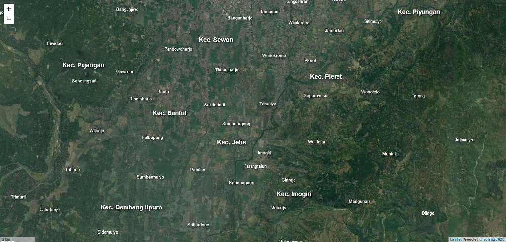

# Leaflet GeoJSON Label

Repositori ini berisi tentang cara menampilkan label dari data GeoJSON di Leaflet JS selayaknya label pada aplikasi GIS Desktop. Untuk menampilkan GeoJSON menggunakan _[jQuery](https://jquery.com)_ sedangkan untuk menampilkan label mengadopsi dari QGIS2WEB yang menggunakan library _[rbush](https://github.com/mourner/rbush)_ dan _[labelgun](https://github.com/Geovation/labelgun)_.

---
**Screenshot:**

---

**Demo:**

> Polygon Label: [https://anshori.github.io/leaflet-geojson-label/](https://anshori.github.io/leaflet-geojson-label/)

> Marker Label: [https://anshori.github.io/leaflet-geojson-label/marker.html](https://anshori.github.io/leaflet-geojson-label/marker.html)

> Point Label without Marker: [https://anshori.github.io/leaflet-geojson-label/point.html](https://anshori.github.io/leaflet-geojson-label/point.html)

---

`unsorry@2020`