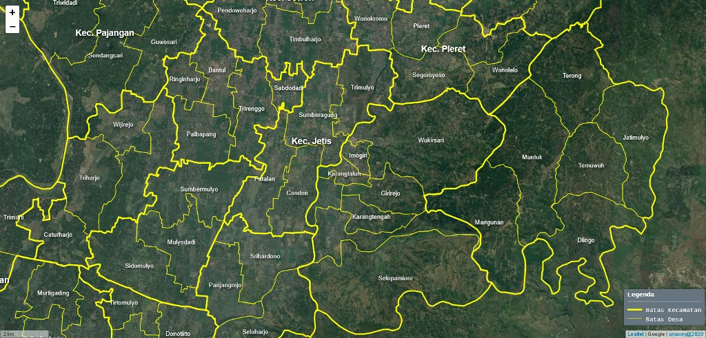
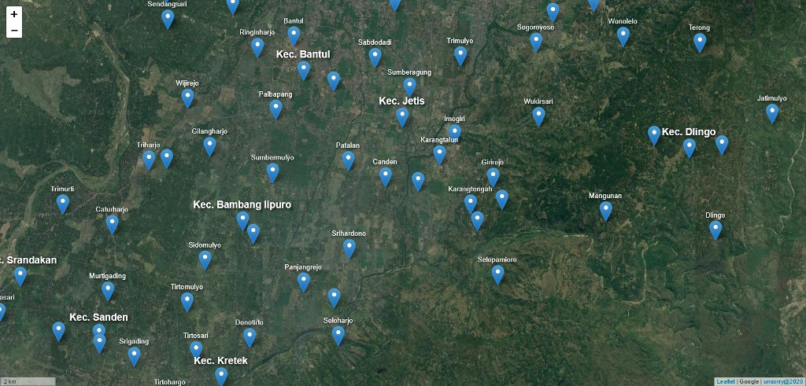

# Leaflet GeoJSON Label

Repositori ini berisi tentang cara menampilkan label dari data geojson di Leaflet JS selayaknya label pada aplikasi GIS Desktop.

Mengadopsi label dari QGIS2WEB yang menggunakan library _[rbush](https://github.com/mourner/rbush)_ dan _[labelgun](https://github.com/Geovation/labelgun)_.

---

---

> Demo:

> Polygon Label: [https://unsorry.net/git/leaflet-geojson-label](https://unsorry.net/git/leaflet-geojson-label)

> Point Label: [https://unsorry.net/git/leaflet-geojson-label/point.html](https://unsorry.net/git/leaflet-geojson-label/point.html)

---

`unsorry@2020`